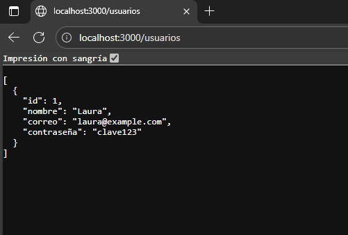
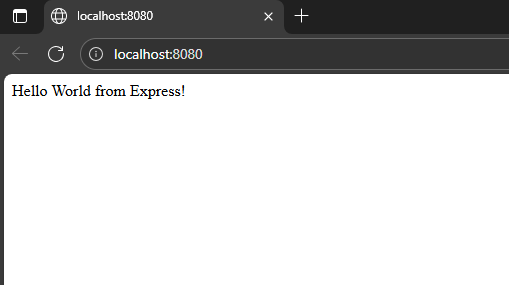
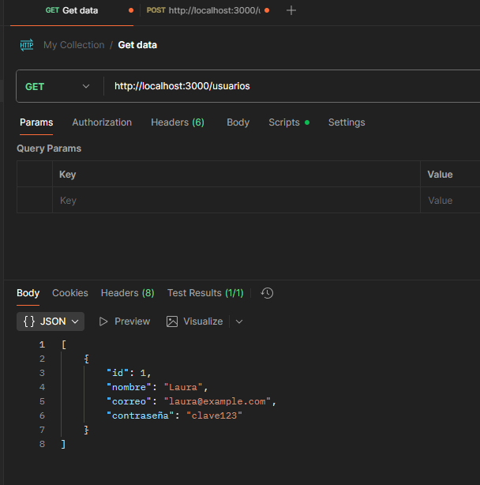

# Informe de Práctica: Desarrollo Web 4

**Autor:** Samuel Briones  
**Fecha:** Octubre 2025

---

## Introducción
Este documento describe el desarrollo de una API REST básica utilizando Node.js, Express y PostgreSQL. Se incluyen instrucciones, capturas de pantalla y evidencias del proceso.

---

## 1. Configuración del Proyecto (Sesión 1)

### 1.1 Inicialización del proyecto
- Comando ejecutado:
  ```bash
  npm init -y
  ```
- Instalación de dependencias:
  ```bash
  npm install express cors pg
  ```

### 1.2 Configuración del servidor
- Se creó el archivo `server.js` con un endpoint GET `/`.
- El servidor se ejecuta en [http://localhost:3000](http://localhost:3000).

#### Captura de pantalla: Estructura inicial del proyecto



---

## 2. Base de Datos en PostgreSQL (Sesión 2)

### 2.1 Creación de la base de datos y tabla
- Base de datos: `usuarios_db`
- Tabla:
  ```sql
  CREATE TABLE usuarios (
    id SERIAL PRIMARY KEY,
    nombre VARCHAR(50),
    correo VARCHAR(100),
    contraseña VARCHAR(100)
  );
  ```

### 2.2 Conexión desde Node.js
- Archivo `db.js` configurado con `pg.Pool`.
- Prueba de conexión con consulta:
  ```sql
  SELECT * FROM usuarios;
  ```

#### Captura de pantalla: Prueba de conexión



---

## 3. API REST CRUD (Sesión 3)

### 3.1 Endpoints implementados
- `POST /usuarios`: Registrar usuario.
- `GET /usuarios`: Listar todos los usuarios.

### 3.2 Pruebas con Postman
- Se realizaron pruebas de los endpoints usando Postman.

#### Captura de pantalla: Pruebas en Postman



---

## 4. Estructura del Proyecto

- `server.js`: Servidor Express y rutas principales.
- `db.js`: Configuración de la base de datos PostgreSQL.
- `package.json`: Dependencias y scripts del proyecto.
- `evidencias/`: Carpeta para guardar capturas de pantalla y evidencias.

---

## 5. Notas
- Asegúrate de tener PostgreSQL instalado y en ejecución.
- Modifica las credenciales de la base de datos en `db.js` según tu entorno.
- Guarda las capturas de pantalla en la carpeta `evidencias/`.

---

## 6. Evidencias

Agrega aquí las capturas de pantalla relevantes:

- 
- 
- 
